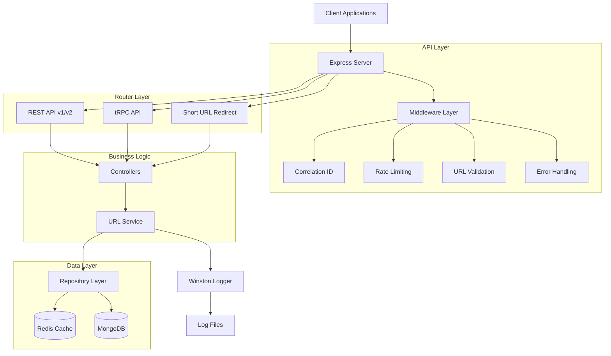
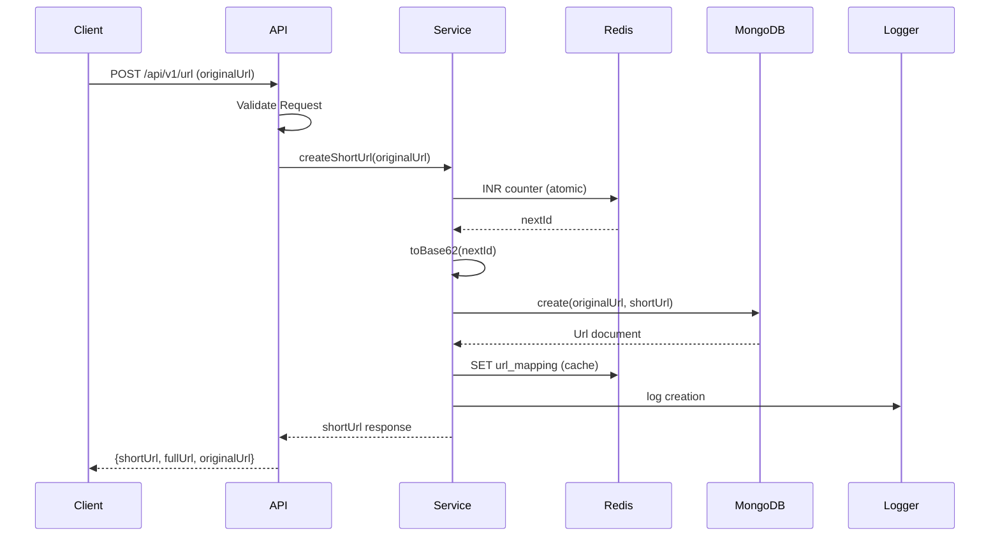
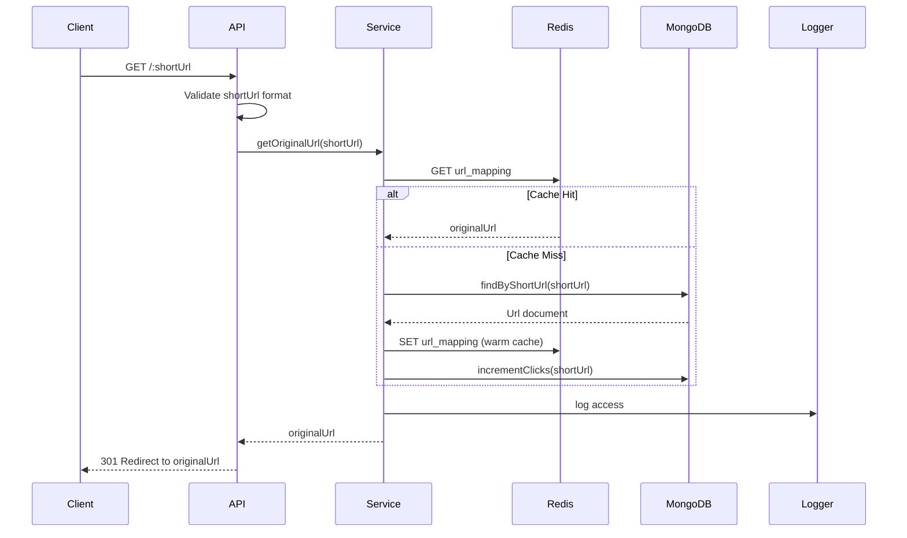
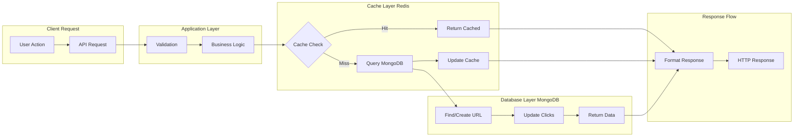

# URL Shortener Service

A high-performance, scalable URL shortener service built with Express, TypeScript, MongoDB, Redis, and tRPC. This service demonstrates modern backend architecture with comprehensive error handling, caching strategies, and multiple API interfaces.

## 🚀 Features

- **URL Shortening**: Convert long URLs to short, manageable links using Base62 encoding
- **Click Tracking**: Monitor how many times each short URL has been accessed
- **High Performance**: Multi-layer caching with Redis for sub-millisecond response times
- **Multiple API Interfaces**:
  - REST API (v1 and v2)
  - tRPC for type-safe API calls
- **Base62 Encoding**: Efficient short URL generation using atomic Redis counters
- **Rate Limiting**: Express rate limiting to prevent abuse (10 requests/minute per IP)
- **Comprehensive Logging**: Winston logger with correlation tracking
- **Error Handling**: Centralized error handling with correlation IDs
- **Database Optimization**: Optimized MongoDB queries with proper indexing
- **Type Safety**: Full TypeScript implementation with Zod validation
- **Testing**: Comprehensive unit and integration tests with Jest


## Architecture Overview

This URL shortener service follows a layered architecture pattern with separation of concerns:



## Advanced Workflow

### URL Shortening Flow



### URL Redirection Flow



## Project Structure

```
.
├── src/
│   ├── config/                    # Configuration Management
│   │   ├── db.ts                 # MongoDB connection setup
│   │   ├── index.ts              # Central config exports & env loading
│   │   ├── logger.config.ts      # Winston logger configuration
│   │   └── redis.ts              # Redis client setup
│   │
│   ├── controllers/               # Request Handlers & tRPC Procedures
│   │   ├── ping.controller.ts    # Health check controller
│   │   └── url.controller.ts     # URL operations & tRPC procedures
│   │
│   ├── dtos/                      # Data Transfer Objects
│   │   └── url.dto.ts            # URL-related DTOs
│   │
│   ├── middlewares/               # Express Middlewares
│   │   ├── correlation.middleware.ts  # Request correlation tracking
│   │   ├── error.middleware.ts       # Global error handling
│   │   ├── rateLimiter.middleware.ts  # Rate limiting (10 req/min)
│   │   └── urlValidation.middleware.ts # URL validation
│   │
│   ├── models/                    # MongoDB Models
│   │   └── Url.ts                # URL schema and interface
│   │
│   ├── repositories/              # Data Access Layer
│   │   ├── cache.repository.ts   # Redis operations
│   │   └── url.repository.ts     # MongoDB operations
│   │
│   ├── routers/                   # API Routes
│   │   ├── trpc/                 # tRPC router setup
│   │   │   ├── context.ts       # tRPC context
│   │   │   ├── index.ts         # tRPC router aggregation
│   │   │   └── url.ts           # tRPC URL procedures
│   │   ├── v1/                   # REST API v1
│   │   │   ├── index.router.ts  # v1 route aggregation
│   │   │   └── ping.router.ts   # v1 health check
│   │   └── v2/                   # REST API v2
│   │       └── index.router.ts  # v2 route aggregation
│   │
│   ├── services/                  # Business Logic Layer
│   │   └── url.service.ts        # URL business logic
│   │
│   ├── utils/                     # Utility Functions
│   │   ├── base62.ts             # Base62 encoding/decoding
│   │   ├── errors/               # Custom Error Classes
│   │   │   └── app.error.ts     # Application-specific errors
│   │   └── helpers/              # Helper Functions
│   │       └── request.helpers.ts # Request utilities
│   │
│   ├── validators/                # Input Validation
│   │   ├── index.ts              # Validation exports
│   │   └── ping.validator.ts     # Ping validation schemas
│   │
│   ├── tests/                     # Test Suite
│   │   ├── integration/          # Integration tests
│   │   │   ├── controllers/     # Controller integration tests
│   │   │   └── routers/         # Router integration tests
│   │   └── unit/                 # Unit tests
│   │       ├── middlewares/      # Middleware unit tests
│   │       ├── repositories/    # Repository unit tests
│   │       ├── services/        # Service unit tests
│   │       └── utils/           # Utility unit tests
│   │
│   └── server.ts                  # Application Entry Point
│
├── logs/                          # Rotating Log Files
├── .env                          # Environment Variables
├── .gitignore                    # Git Ignore Rules
├── package.json                  # Dependencies & Scripts
├── tsconfig.json                 # TypeScript Configuration
└── README.md                     # This Documentation
```

## Database Design & Flow

### MongoDB Schema

```typescript
// URL Collection Schema
interface IUrl extends Document {
  originalUrl: string;      // The original long URL
  shortUrl: string;        // Generated short code (unique, indexed)
  clicks: number;          // Access counter (default: 0)
  createdAt: Date;         // Creation timestamp
  updatedAt: Date;         // Last update timestamp
}

// Indexes for Performance
- shortUrl: unique (for fast lookups)
- createdAt: -1 (for sorting by creation date)
```

### Redis Data Structure

```
# Counter for unique ID generation
short_url_counter: number (atomic increment)

# URL Mappings for cache
url_mapping:{shortUrl}: originalUrl (TTL: 24 hours)

# Rate limiting
rate_limit:{ip}: count (TTL: 1 minute)
```

### Base62 Encoding Algorithm

```typescript
// Characters: 0-9, a-z, A-Z (62 characters)
// Example: 12345 -> '3d7'
// Used for efficient short URL generation
```

### Database Flow Diagram



## Performance Optimizations

### Caching Strategy
- **Read-Through Cache**: Cache miss triggers database query and cache population
- **Write-Through Cache**: New URLs are immediately cached after database creation
- **TTL Management**: Cache entries expire after 24 hours to ensure freshness

### Database Optimizations
- **Atomic Counters**: Redis INR for collision-free short URL generation
- **Compound Indexes**: Optimized queries for common access patterns
- **Connection Pooling**: Efficient database connection management

### Application Optimizations
- **Correlation Tracking**: End-to-end request tracing
- **Rate Limiting**: 10 requests per minute per IP to prevent abuse
- **Structured Logging**: Efficient log aggregation and monitoring
- **Base62 Encoding**: Efficient short URL generation using 62-character alphabet

## Getting Started

### Prerequisites

- Node.js 18+
- MongoDB 6.0+
- Redis 7+
- Docker & Docker Compose (optional)

### 1. Clone the repository

```sh
git clone https://github.com/VivekKumarDwivedi/MyUrl-Shortner.git <ProjectName>
cd <ProjectName>
```

### 2. Install dependencies

```sh
npm install
```

### 3. Configure environment variables

Create a `.env` file in the root directory:

```env
PORT=3001
MONGO_URI="mongodb://localhost:27017/short_my_url"
REDIS_URL="redis://localhost:6379"
REDIS_COUNTER_KEY="short_url_counter"
BASE_URL="http://localhost:3001"
```

Adjust values as needed for your environment.

### 4. Start the Application

**Development mode:**

```bash
npm run dev
```

**Production mode:**

```bash
npm start
```

The server will start on the port specified in `.env` (default: 3001).

### 5. Run Tests

```bash
# Run all tests
npm test

# Run unit tests only
npm run test:unit

# Run with coverage
npm test -- --coverage
```

### 6. Code Quality Checks

```bash
# Lint code
npm run lint

# Fix linting issues
npm run lint:fix

# Format code
npm run format
```

## API Documentation

### REST Endpoints

#### URL Management
- `POST /api/v1/url`  
  Create a short URL from a long URL.
  ```json
  // Request
  {
    "originalUrl": "https://example.com/very/long/url"
  }
  
  // Response
  {
    "id": "64a7b8c9d1e2f3g4h5i6j7k8",
    "shortUrl": "abc123",
    "originalUrl": "https://example.com/very/long/url",
    "fullUrl": "http://localhost:3001/abc123",
    "createdAt": "2023-07-06T12:34:56.789Z",
    "updatedAt": "2023-07-06T12:34:56.789Z"
  }
  ```

- `GET /:shortUrl`  
  Redirects to the original URL and increments click count.

#### Health Checks
- `GET /api/v1/ping`  
  Basic health check endpoint.
  ```json
  {
    "status": "ok",
    "timestamp": "2023-07-06T12:34:56.789Z",
    "uptime": 3600.5
  }
  ```

### tRPC Endpoints

#### URL Procedures
- `url.create`  
  Type-safe URL shortening.
  ```typescript
  // Input
  { originalUrl: string }
  
  // Output
  {
    id: string;
    shortUrl: string;
    originalUrl: string;
    fullUrl: string;
    createdAt: Date;
    updatedAt: Date;
  }
  ```

- `url.getOriginalUrl`  
  Retrieve original URL from short code.
  ```typescript
  // Input
  { shortUrl: string }
  
  // Output
  {
    originalUrl: string;
    shortUrl: string;
  }
  ```

### Rate Limiting
- **Endpoints**: All API endpoints are rate-limited
- **Limit**: 10 requests per minute per IP address
- **Response**: HTTP 429 with error message when limit exceeded

## Testing Strategy

### Test Structure

The project follows a comprehensive testing approach with both unit and integration tests:

```
src/tests/
├── integration/           # Integration tests
│   ├── controllers/      # Controller integration tests
│   └── routers/          # Router integration tests
└── unit/                 # Unit tests
    ├── middlewares/      # Middleware unit tests
    ├── repositories/    # Repository unit tests
    ├── services/        # Service unit tests
    └── utils/           # Utility unit tests
```

### Test Categories

#### Unit Tests
- **Services**: Business logic testing with mocked dependencies
- **Repositories**: Data access layer testing
- **Middlewares**: Request processing and validation
- **Utils**: Utility functions and algorithms

#### Integration Tests
- **Controllers**: End-to-end API endpoint testing
- **Routers**: Route integration and middleware flow

### Running Tests

```bash
# Run all tests
npm test

# Run unit tests only
npm run test:unit

# Run tests with coverage
npm test -- --coverage

# Watch mode for development
npm test -- --watch
```

### Test Configuration

- **Framework**: Jest with TypeScript support
- **Environment**: Node.js test environment
- **Coverage**: Reports generated for all TypeScript files
- **Mocking**: MongoDB Memory Server for database tests

## Monitoring & Observability

### Logging Strategy
The application uses structured logging with Winston:

```typescript
// Log Format
{
  "timestamp": "2023-07-06T12:34:56.789Z",
  "level": "info",
  "correlationId": "abc123-def456-ghi789",
  "message": "URL created successfully",
  "metadata": {
    "shortUrl": "abc123",
    "originalUrl": "https://example.com",
    "processingTime": 45
  }
}
```

### Health Monitoring
- **Application Health**: `/api/v1/ping` endpoint
- **Database Connectivity**: MongoDB connection status
- **Cache Status**: Redis connection and performance metrics

### Performance Metrics
- **Response Times**: API endpoint latency tracking
- **Cache Hit Rates**: Redis cache effectiveness
- **Error Rates**: Application error frequency
- **Throughput**: Requests per second monitoring

## Security Considerations

### Input Validation
- Zod schema validation for all inputs
- URL format validation and sanitization
- Protection against malicious URLs

### Error Handling
- Secure error responses (no sensitive data leakage)
- Correlation ID tracking for debugging
- Graceful degradation on service failures

### Rate Limiting
- 10 requests per minute per IP address
- Prevents abuse and ensures fair usage
- Configurable limits for different environments

### Environment Configuration
```env
# Application
NODE_ENV=production
PORT=3001
BASE_URL=https://short.ly

# Database
MONGO_URI=mongodb://mongo-cluster:27017/short_my_url
MONGO_OPTIONS=retryWrites=true&w=majority

# Cache
REDIS_URL=redis://redis-cluster:6379
REDIS_COUNTER_KEY=short_url_counter
REDIS_TTL=86400

# Logging
LOG_LEVEL=info
LOG_FILE_PATH=/var/log/urlshortner
```

## Technologies Used

- [Express](https://expressjs.com/)
- [TypeScript](https://www.typescriptlang.org/)
- [MongoDB + Mongoose](https://mongoosejs.com/)
- [Redis](https://redis.io/)
- [tRPC](https://trpc.io/)
- [Zod](https://zod.dev/) (validation)
- [Winston](https://github.com/winstonjs/winston) (logging)
- [Nodemon](https://nodemon.io/) (development tool)

## License

This project is licensed under the MIT License - see the [LICENSE](LICENSE) file for details.

## Acknowledgments

- Inspired by the need for a simple, efficient URL shortening service.
- Built as a personal project to explore and showcase skills in modern web development technologies.
